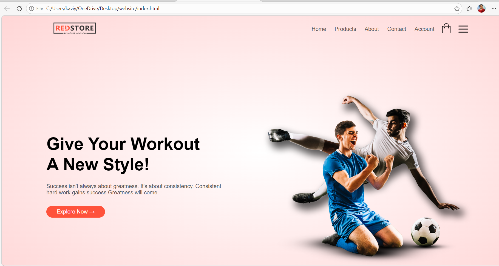
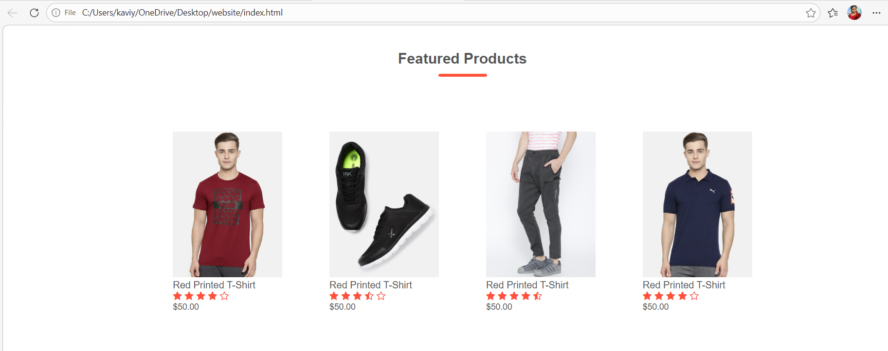
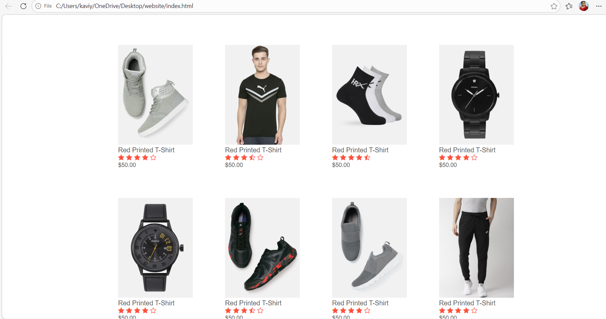
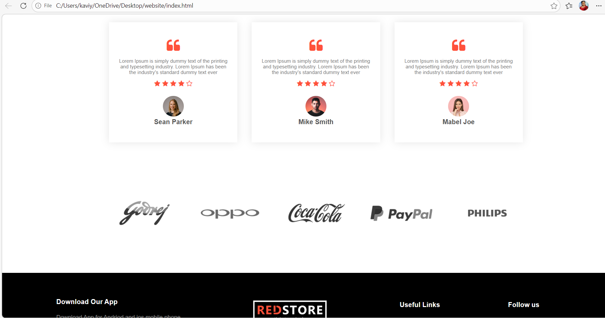
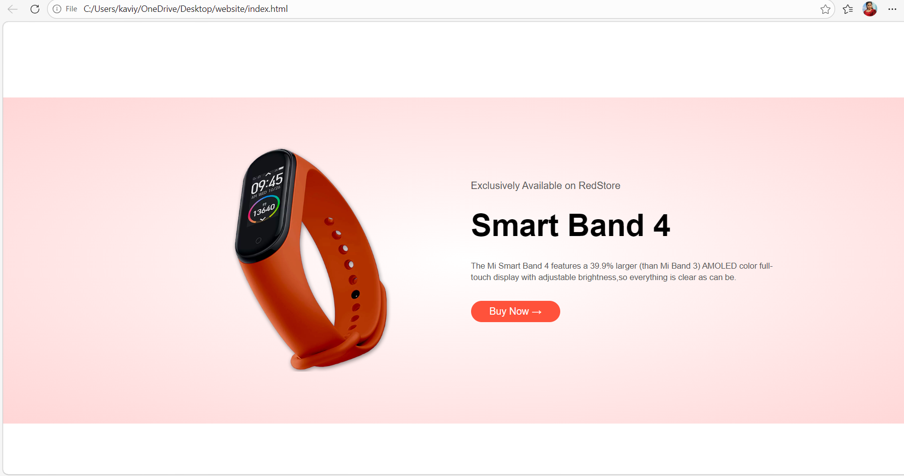

# 🛒 E-Commerce Website

A fully responsive **E-Commerce Website** developed using **HTML, CSS, and JavaScript**. This project focuses on creating a modern, user-friendly online shopping interface with a clean design and responsive layout.

## 🚀 Features

- 🏠 Modern Home Page with Hero Section
- 🛍️ Product Listing with Images, Ratings, and Prices
- ⭐ Featured Products Section
- 📊 Dashboard Page
- 🛒 Buy Now Functionality
- 📱 Fully Responsive Design
- 🎨 Clean and User-Friendly Interface

## 🛠️ Technologies Used

- HTML5
- CSS3
- JavaScript

## 📂 Project Structure

```
E-Commerce-Website/
│── index.html
│── style.css
│── script.js
│── images/
│── screenshots/
└── README.md
```

## 📸 Screenshots

### 🏠 Home Page


### 🛍️ Product Page


### ⭐ Featured Products


### 📊 Dashboard


### 🛒 Buy Now Page


## 🎯 Skills Gained

Through this project, I improved my skills in:

- Responsive Web Design
- HTML5 & CSS3
- JavaScript DOM Manipulation
- UI/UX Design
- Front-end Development
- Project Structure and Organization

## 🔮 Future Enhancements

- Shopping Cart
- User Authentication
- Product Search & Filters
- Wishlist Feature
- Payment Gateway Integration
- Backend & Database Support

## 👩‍💻 Author

**Kaviya M**

⭐ If you like this project, feel free to star this repository!
